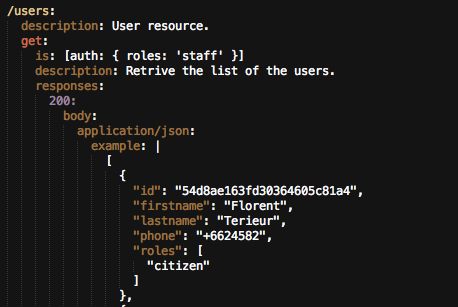

Introduction to concepts of **REST** and **Big Web Service**. Here a summary about those both methods. From the M. Liechti's documentation (HEIG-VD):

#### Big Web Service

* Approach
	* Services are often designed and developed with a RPC style (even if Document-Oriented Services are possible).
* Core Standards
	* Simple Object Access Protocol (SOAP)
	* Web Services Description Language (WSDL)
* Benefits
	* Very rich protocol stack (support for security, transactions, reliable transfer, etc.)
* Problem
	* Very rich protocol stack (complexity, verbosity, incompatibility issues, theoretical human readability, etc.)

#### REST : REpresentational State Transfer

* The state of the application is captured in a set of resources
	* Users, photos, comments, tags, albums, etc.
* Every resource is **identified with a standard format** (e.g. URL)
* Every resource can have **several representations**
* There is one **unique interface for interacting** with resources (e.g.HTTP methods)
 

Source : *https://github.com/SoftEng-HEIGVD/Teaching-HEIGVD-CM_WEBS*

#### RAML documentation - RESTful API Modeling Language 

RESTful API Modeling Language (RAML) is a simple and succinct way of describing practically-RESTful APIs. It encourages reuse, enables discovery and pattern-sharing, and aims for merit-based emergence of best practices. The goal is to help our current API ecosystem by solving immediate problems and then encourage ever-better API patterns. 
We will use this to documentate our API RESTfull

Here an example: 

#### Resources' identification
----

After a brief description of the set theme for this API , we have identified the resources needed in order to define the structure of our URL.

#### Resources

**Users**
Users, memebers, staff etc...

**Issues**
Publications ; they are the heart of our application. They represent the problems identified by users in a city (a tree across the road, a broken streetlight ... etc)

**IssueType**
These are the categories of "problems" identified: Works , Fire, Flood , etc.

**Actions**
This is an operation on an "Issues ", for example the status change from "created" to "in_progress"

**ActionType** 
Corresponds to the type of action performed on an issue.

**Comment** 
a comment on an issue

**Tag** 
Keyword related to issue.