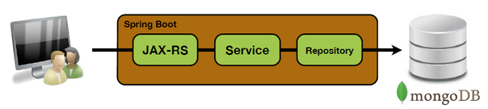

#### SpringBoot

Springboot is a platform for development that include creating a simple REST API in Java and with minimal basic configuration. This is also one of the criticisms made ​​its big brother Spring requiring significant time setting up . With Springboot , things become simpler by giving the opportunity to start an application in five minutes, without any configuration file if it is your descriptor Maven or Gradle project.

----

Advantages :

* Brings the power of Spring Framework and related libraries
* Offers code infrastructure to easily develop and deploy
* Various integrations
* Nothing really new for the core technologies (services, persistence, ...)
* Production ready tools embedded (metrics, health, configuration, ...)
* Big community around Spring technologies
* Not specific to application servers

#### Heroku

Heroku est une plateforme « Cloud » (Platform as a service) qui permet d’héberger, de développer tout type d’application : Web, mobile, tablette, ipad, iphone, android, portail B-to-B, B-toC, site, app métier, sociale, Facebook. Le service supporte de les dernières innovations en terme de language informatique (Ruby on rails / Python / php / java / Node.js / Ember/ Angular…).
