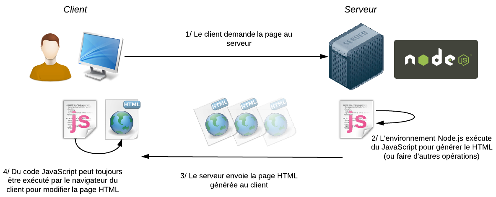

#### Javascript

Node.js is a platform built on Chrome's JavaScript runtime for easily building fast, scalable network applications (not only).

**Why this choice?**

Node.js provides a server-side environment that allows to use the JavaScript language to generate web pages. Basically, it is a replacement server languages ​​like PHP , Java EE , etc.

##### Express
Express is a framework for NodeJS allowing simplified some part of the code (route, template..).

##### Grunt
Grunt is simply a JavaScript Task Runner, a tool that allows you to create automated tasks in JavaScript. Grunt automates many repetitive tasks for you : compress your CSS, minimize your JavaScript… 

##### Yeoman
Yeoman is a combination of tools, which allows to you to setup a complete, automated, efficient and reliable development workflow.
Yo is a tool for generating project skeletons (scaffolding). You can create and share your skeletons. Yo generators are npm modules and you can find one for most popular web frameworks.
