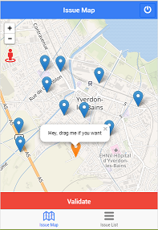
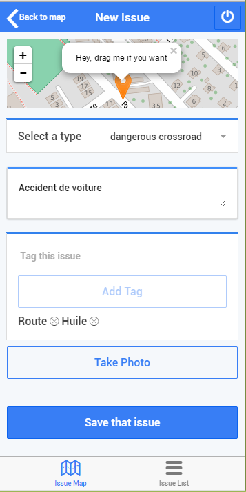
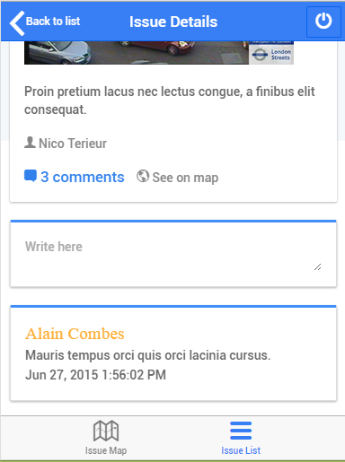

#### Citizen Engagement :

Télécharger l'application mobile pour citoyens résponsables !

Repository Git: [Here](https://github.com/florentplomb/Teaching-HEIGVD-CM_APPMOB-2015-CitizenEngagement "Here")

Vidéo de présentation : [Video](https://github.com/florentplomb/Teaching-HEIGVD-CM_APPMOB-2015-CitizenEngagement "Here")

#### Manuel :

1.Placer une nouvelle issue sur la carte.

2.Saisir toutes les informations relatives à l’issue, puis ajouter une photo.

3.En accédant au détail d'une issue depuis la carte vous pouvez ajouter un commentaire.

