#### Citizen Engagement :

Téléchargez l'application mobile pour citoyens responsables !

Citizen Engagement est une application qui permet à chaque citoyen d'être actif quant à l'amélioration continue de sa ville et sa région. Elle permet à toute personne possédant l'application d'enregistrer de façon rapide et complète chaque désagrément d'ordre public qu'il rencontre. Un lampadaire cassé ou inactif? Un tronçon de route dangereux? ou encore des graffitis sur les murs d'une école? Une seule réponse! Citizen Engagement. En se connectant à l'application, on géolocalise le lieu du problème, on prend une photo et on note une brève description de ce dernier. Grâce à cette application, chaque citoyen est responsable et peut oeuvrer pour la société. Ainsi les personnes chargées de régler ces soucis peuvent avoir des yeux partout.

Repository Git: [Here](https://github.com/florentplomb/Teaching-HEIGVD-CM_APPMOB-2015-CitizenEngagement "Here")

Vidéo de présentation : [Video](https://www.youtube.com/watch?v=wki0t178x2k&feature=youtu.be "Here")

#### Manuel d'utilisation :

### Log in

1.Se connecter à l'application à l'aide d'un nom d'utilisateur et d'un mot de passe. Chaque utilisateur est ainsi répértorié dans la base de données

### Créer une issue

2.Pour poster une "issue" l'utilisateur doit se géolocaliser. Il doit donc activer la géolocalisation de sa machine. Un curseur rouge apparaît pour indiquer sur la carte où se trouve l'utilisateur.
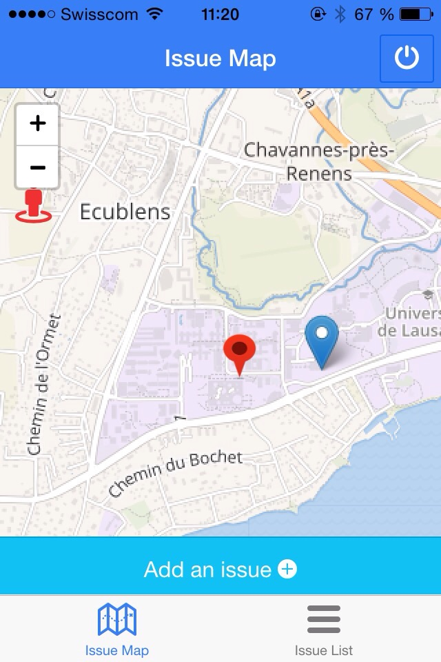

3.Il doit ensuite cliquer sur le bouton "add an issue" puis, suivre les instructions de l'application et placer l'endroit où l'issue le trouve sur la carte.
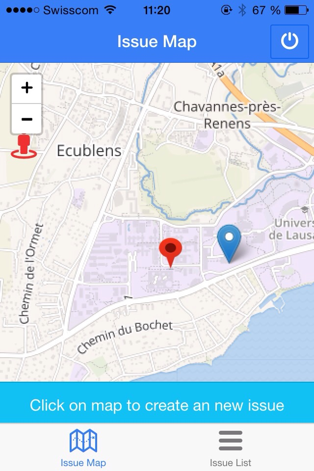

4.Un curseur orange apparaît à l'endroit sélectionné par l'utilisateur pour localiser l'issue qu'il souhaite signaler. L'application demande à l'utilisateur de valider la localisation pour pouvoir continuer.
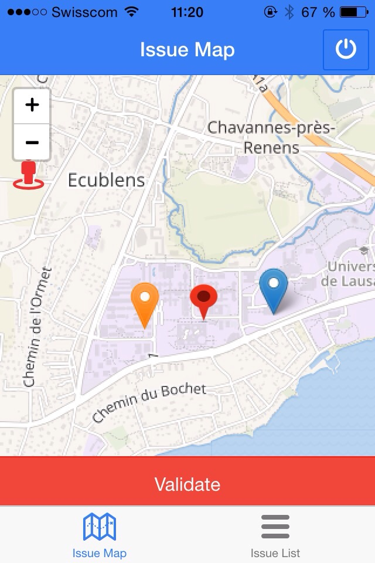

5.La création de l'issue passe par plusieurs étape. L'utilisateur doit tout d'abord sélectionner un type; lampadaire cassé, graffiti ou carrefour dangereux. Il doit y ajouter une description, un ou plusieurs tag et prendre une photo de l'issue. S'il le désire, l'utilisateur peut encore déplacer la localisation de l'issue pour la préciser ou la réctifier.
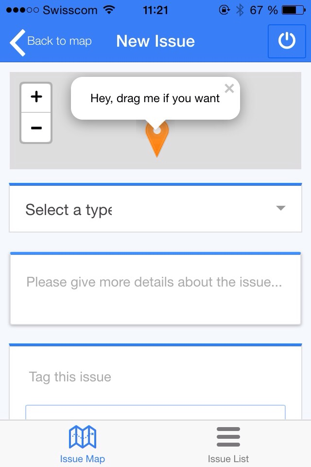

6.L'issue est alors enregistrée. Ceci est confirmé par l'apparition d'un icône vert sur la map. Elle peut être consultée dans l'onglet "issueList" se trouvant dans le footer.
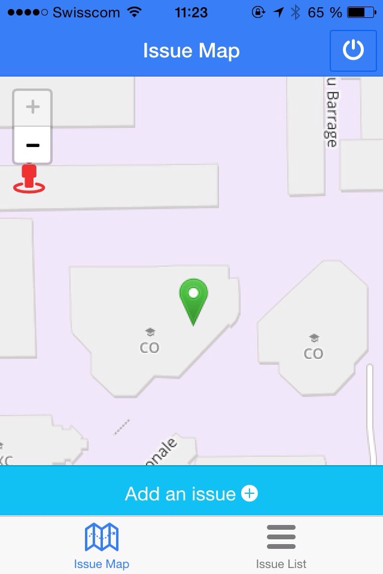

## Consulter une issue

7.Dans l'onglet issueList, on retrouve la liste de toutes les issues précédemment enregistrées par les utilisateurs. Dans cette liste, on voit les informations générales de l'issue; c'est-à-dire son titre, son statut, ses tags et la date d'enregistement.
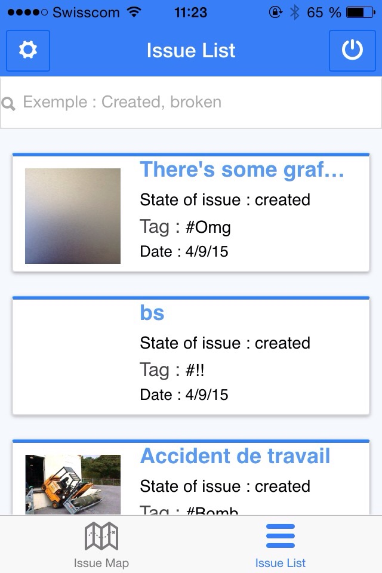

8.Depuis la liste d'issues, on peut faire des recherches d'issues soit avec un outil de recherche intelligent
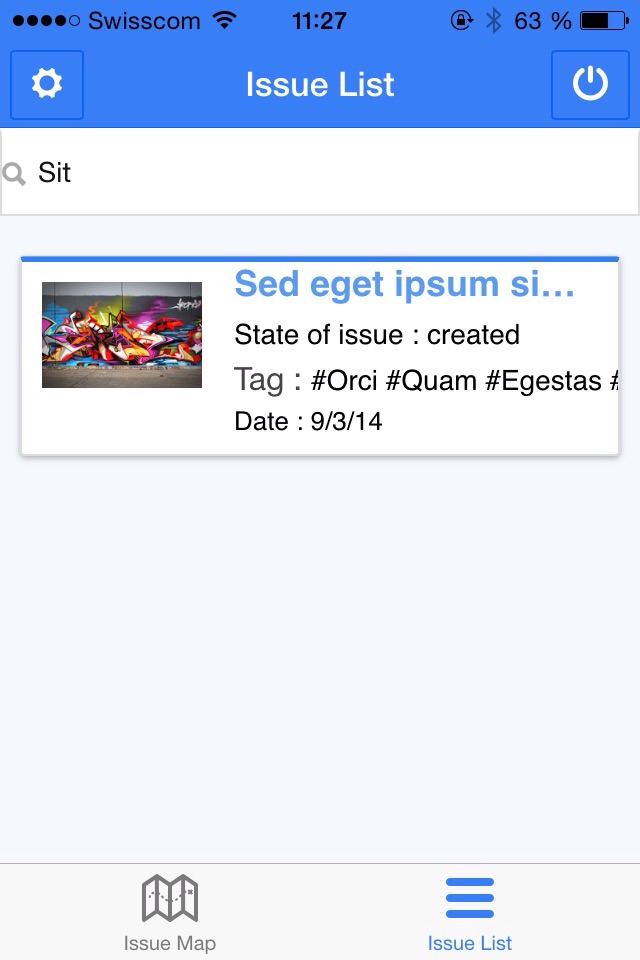
8a.Soit avec le filtre des types d'issues
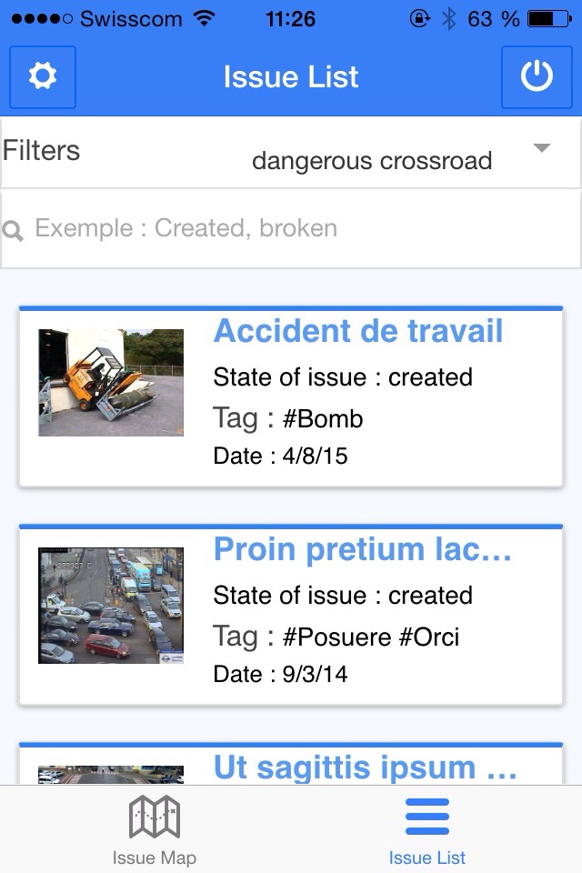

9.On peut accéder aux détails d'une issue en cliquant dessus. On verra alors son titre et son statut à nouveau, la photo en grande taille, sa description. Ici, on peut ajouter des commentaires sur l'issue et on peut consulter les commentaires qui lui sont associés. On peut accéder à son emplacement directement sur la carte grâce à l'onglet au raccourci "see on map" et savoir qui a posté l'issue.
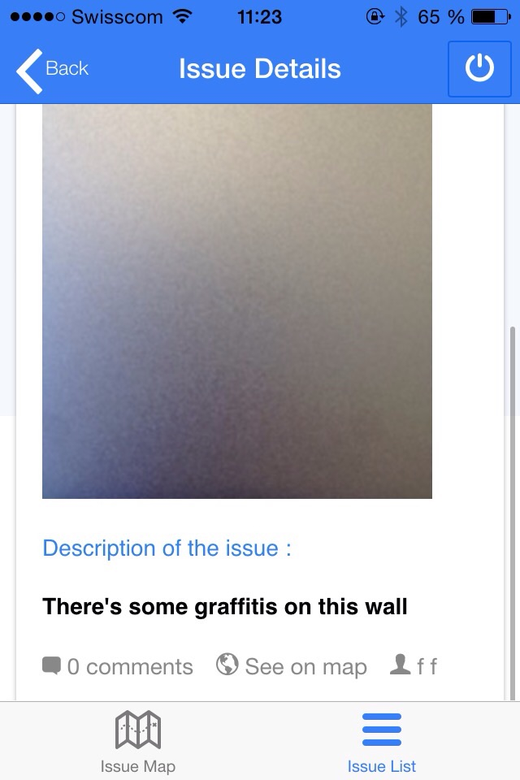
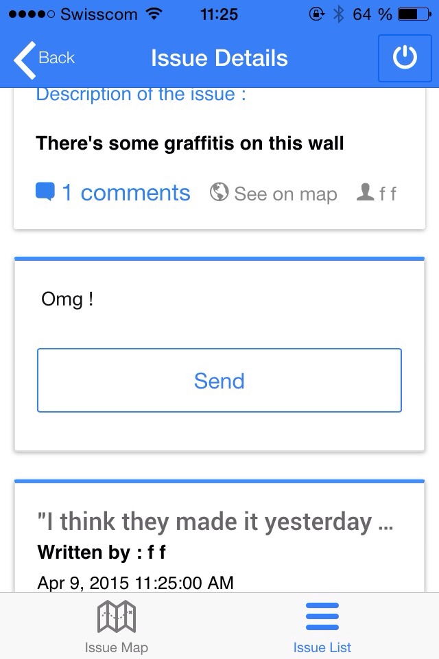

9.Une deuxième façon de consulter les isssues déjà postées est d'aller sur la map et de cliquer sur icônes. Ainsi, on peut voir une petite fiche avec la description et la photo de l'issue. Depuis là, on peut accéder aux détails de cette issue en cliquant sur "details"
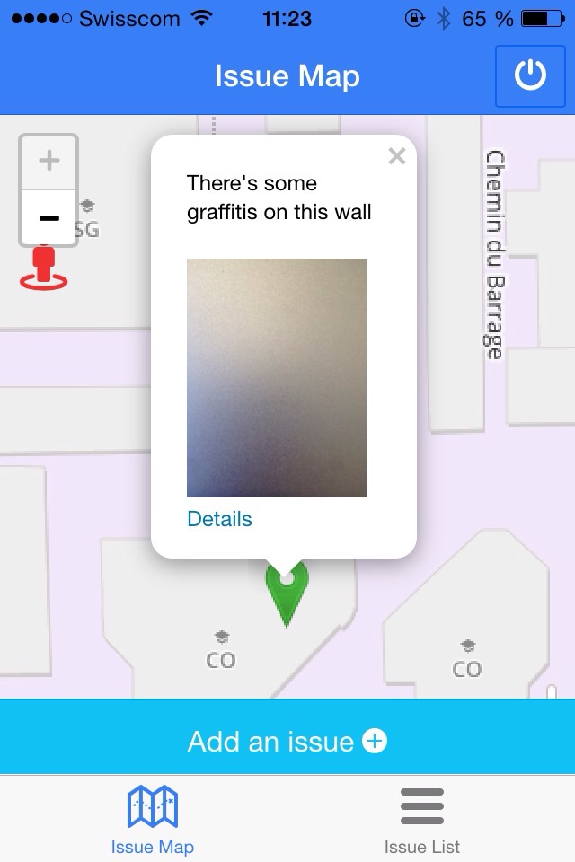

